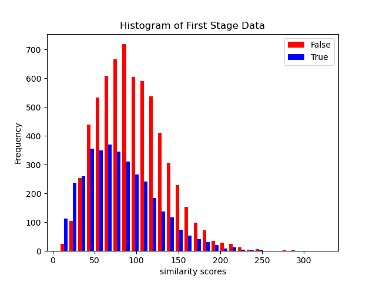
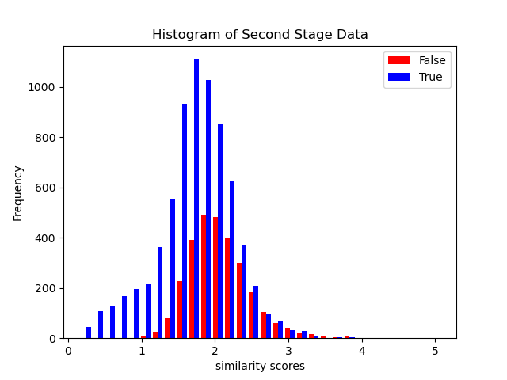
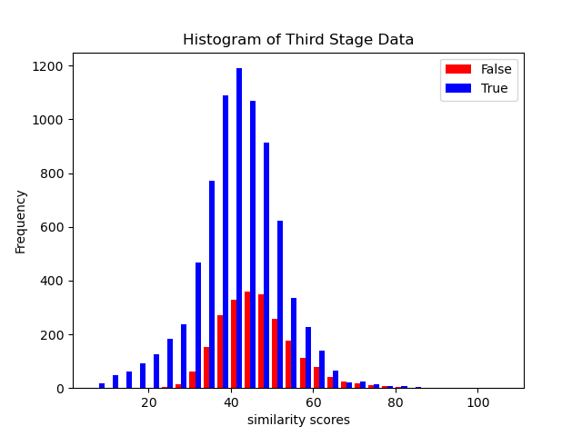

# zjuSummerCamp
A Try About Optimizing the CLIP image classification model based on similarity retrieval in vector databases

## Quick Start

1. **Clone the Repository**:

`git clone https://github.com/Yicorner/zjuSummerCamp.git`

2. **Navigate to the Project Directory**:

`cd zjuSummerCamp`

3. **Download CIFAR10 Dataset**:

`bash get_dataset.sh`

Once executed, the datasets will be untarred in your `./data` directory.

## Image Classification

Run `test.py` to predict an image category from the `Images` folder. All images within this folder are randomly picked from the test data in the CIFAR10 dataset.

`python test.py --stage <origin|first|second|third|all> --image_name <dog|ship|deer|cat|...>`

for example:

`python test.py --stage all --image_name cat`

### Stage Descriptions:
- **origin**: Use the original clip to predict the image category.
- **first**: Exclusively use the vector database for image categorization. The clip processing time is bypassed, making all time cost related to query time.
- **second**: Utilize half of the clip image encoder, then query the vector database for a similarity vector result. This reduces clip time but introduces additional query time.
- **third**: Use nearly the complete clip image encoder and then query the vector database similarly as in the second stage. This has a lesser reduction in clip time but introduces additional query time.
- **all**: Execute stages origin, first, second, and third sequentially.

## Testing Your Own Image

If you want to test your own image, please compress them into 32 x 32 pixels with RGB channels and place it into the Images folder. For example, if you named CNDotaNeverDie.png, you can test it with the command:

`python test.py --stage all --image_name CNDotaNeverDie`

However, for stages first, second, and third, the category for CNDotaNeverDie.png can only be categories present in CIFAR-10. Otherwise, it will predict incorrectly.

## Performance Testing

To test the performance of the origin, utilize `perf_test.py`. This script allows for testing on all test images in cifar10 dataset for accuracy, measuring the time cost in clip encoder, and querying time in vector database.

`python perf_test.py --stage <origin|first|second|third> [--num <n>] [--batch_size <batch_size>] [--display_freq <frequency>] [--time <True|False>]`

for example:

`python perf_test.py --stage third --num 2 --batch_size 3 --display_freq 1 --time True`

### Argument Descriptions:
- **--stage**: Same as described earlier, a mandatory argument.
- **--num**: Number of batches. Ensure `(num * batch_size) > 0` and `< 10,000`. Default is all images.
- **--batch_size**: Defines the batch size. Default is `100`.
- **--display_freq**: Determines the frequency of displaying intermediate results. Default is `1`.
- **--time**: Toggle to measure the test time. Default is `False`.

## Results

Below are histograms representing data from the first, second, and third stages respectively. Each figure's x-axis showcases the vector similarity—with higher values indicative of increased dissimilarity—while the y-axis delineates the count of classifications. Classifications are partitioned into correctly (depicted in red) and incorrectly (shown in blue) categorized.

| Stage        | Histogram   | Accuracy  |
|:------------:|:-----------:|:---------:|
| First Stage  |  | 35.39% |
| Second Stage |  | 71.5%  |
| Third Stage  |   | 77.31% |

### Note on Testing:

Due to the lengthy duration required to test all images, I have preemptively executed tests on all the images and saved the results under the directory: `./results/complete_result/`. For those interested in diving deeper into the methodologies and findings, the project paper is available as `项目报告.pdf` in the aforementioned directory. 

## Join and Contribute

We welcome all contributors and enthusiasts. Dive into the project and enjoy!
You can copy and paste this markdown content directly into your README.md file.

